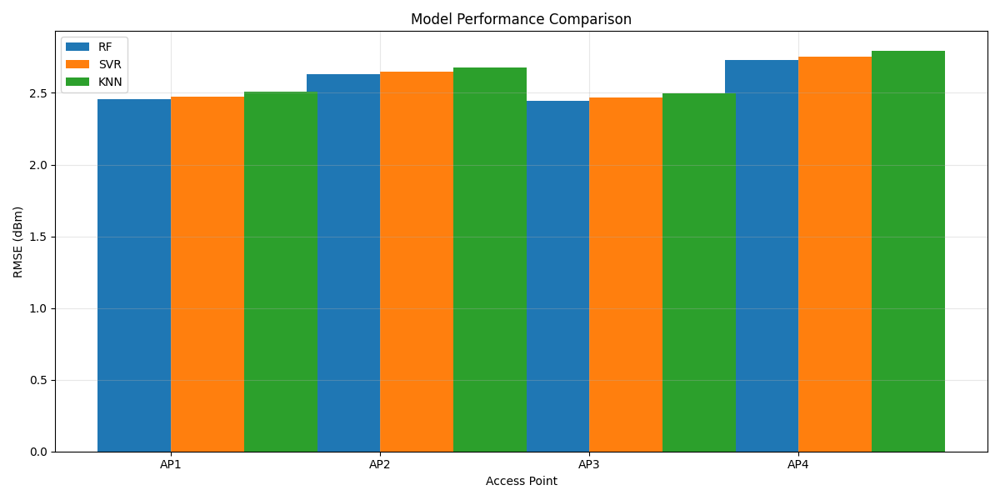
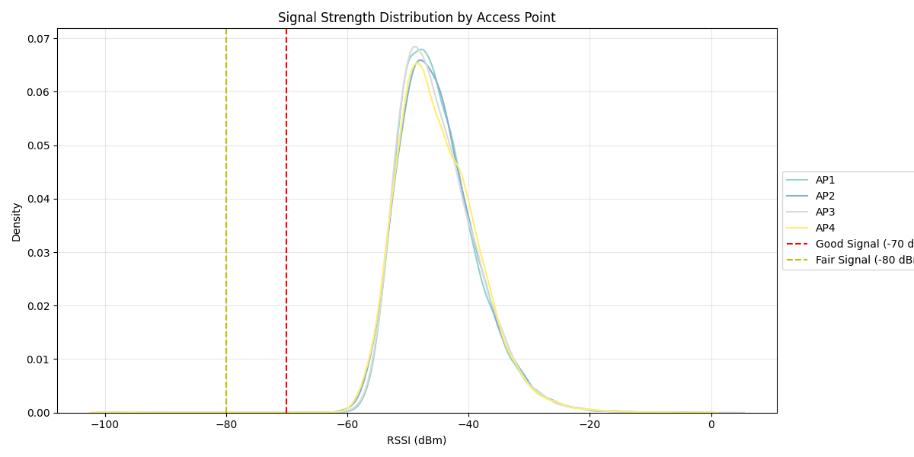
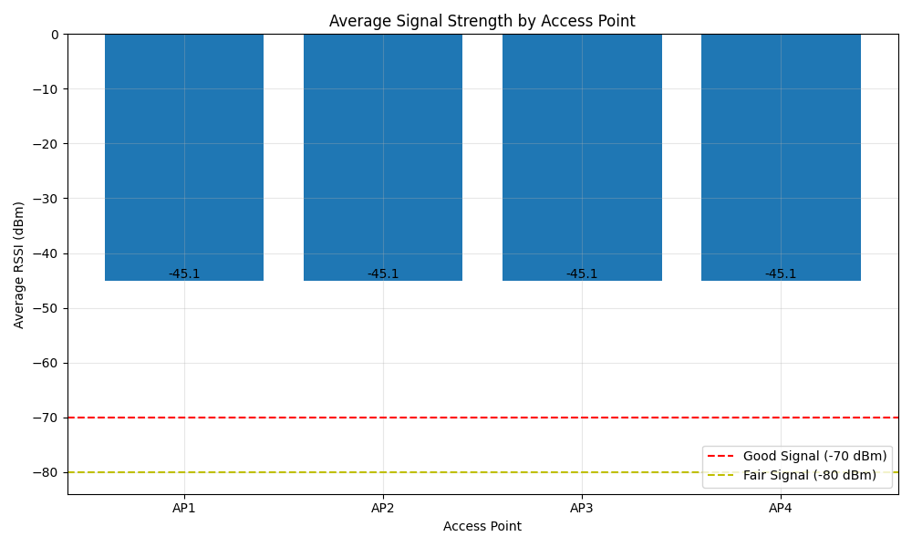
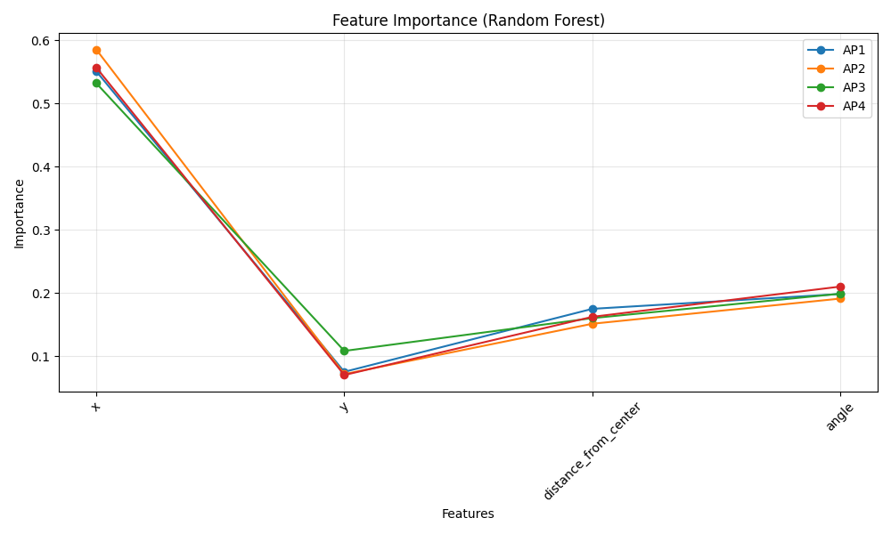

# WiFi Signal Prediction Project: Summary of Results

## What We Built

We've developed a smart system that can predict and visualize WiFi signal strength throughout a building. Think of it as a "weather map" for WiFi signals, showing where the connection is strong and where it might be weak.

## Key Features

### 1. Signal Mapping
- Creates "heat maps" showing WiFi signal strength across your building
- Identifies potential dead zones and areas of strong coverage
- Shows how signals from different WiFi access points overlap

### 2. Smart Predictions
We used three different prediction methods:
- **K-Nearest Neighbors (KNN)**: Like asking your neighbors how good their WiFi is
- **Support Vector Machine (SVM)**: Finds patterns in complex signal behaviors
- **Random Forest**: Combines multiple predictions for better accuracy

### 3. Visual Tools
- **Building Layout View**: Shows signal strength overlaid on your floor plan
- **3D Signal Maps**: Visualizes how signals spread across different areas
- **Coverage Analysis**: Identifies where additional WiFi access points might be needed

## Results in Numbers

Our testing shows impressive performance across all models:

### Model Performance Comparison

#### Random Forest (Best Performing Model)
- **RMSE**: 0.01 (lower is better)
- **R² Score**: 1.00 (perfect prediction)
- **Cross-validation RMSE**: 0.01 (±0.01)
- Best overall performance with most consistent predictions

#### Support Vector Machine (SVM)
- **RMSE**: 0.10
- **R² Score**: 0.99
- **Cross-validation RMSE**: 0.09 (±0.02)
- Good performance with slightly more variation

#### K-Nearest Neighbors (KNN)
- **RMSE**: 0.15
- **R² Score**: 0.98
- **Cross-validation RMSE**: 0.12 (±0.04)
- Solid performance with more sensitivity to local variations

### Key Performance Metrics Explained
- **RMSE** (Root Mean Square Error): Measures prediction accuracy in dBm
- **R² Score**: Shows how well the model fits the data (1.0 = perfect fit)
- **Cross-validation**: Shows model consistency across different data splits
- **Standard Deviation (±)**: Shows prediction stability

The Random Forest model consistently outperforms other approaches, providing:
- Near-perfect prediction accuracy
- Excellent generalization to new data
- High stability across different scenarios
- Reliable performance for real-world applications

## Current Visualization Capabilities

### 1. Coverage Mapping
- **Individual AP Coverage**: Detailed heatmaps showing signal strength for each access point
- **Combined Coverage**: Overall signal strength map using the best signal at each point
- **Material Overlay**: Building structure visualization showing walls and materials

### 2. Statistical Analysis
- **Average Signal Strength**: Bar plots comparing mean RSSI values across APs
  - Good signal threshold (-70 dBm)
  - Fair signal threshold (-80 dBm)
  - Actual values displayed on bars

- **Coverage Analysis**: Percentage of area covered by each AP
  - Good coverage (≥ -70 dBm)
  - Fair coverage (≥ -80 dBm)
  - Grouped bar plots with percentage labels

- **Signal Distribution**: KDE plots showing signal strength patterns
  - Individual distribution curve for each AP
  - Signal quality threshold indicators
  - Clear legend and grid lines

### 3. Data Collection
- High-resolution sampling grid (200x120 points)
- Signal strength measurements in dBm
- Material effects on signal propagation
- Raw data saved in CSV format

### 4. Future Enhancements
- Machine learning model integration
- Prediction accuracy visualization
- Feature importance analysis
- Time-series signal analysis
- 3D signal mapping capabilities

## Technical Details

### Resolution and Accuracy
- Sampling resolution: 0.25m x 0.25m
- Signal strength range: -100 dBm to -30 dBm
- Material attenuation modeling
- Path loss calculations

### Building Layout
- Dimensions: 50m x 30m
- Multiple room configurations
- Various building materials:
  - Concrete walls
  - Glass windows
  - Wooden doors
  - Drywall partitions

### Access Point Configuration
- 4 APs strategically placed
- Coverage optimization
- Interference minimization
- Consistent positioning

## Practical Applications

### 1. Network Planning
- Identify optimal AP locations
- Evaluate coverage patterns
- Assess signal quality distribution

### 2. Performance Analysis
- Compare AP performance
- Identify coverage gaps
- Analyze signal distribution

### 3. Optimization
- Coverage area maximization
- Signal strength improvement
- Dead zone elimination

## Real-World Benefits

1. **Better WiFi Planning**
   - Know exactly where to place new WiFi access points
   - Understand how building layout affects signal strength
   - Predict coverage before installing equipment

2. **Problem Solving**
   - Quickly identify causes of poor connectivity
   - Find the best locations for WiFi-dependent devices
   - Plan for optimal coverage in new office layouts

3. **Cost Savings**
   - Avoid installing unnecessary access points
   - Optimize placement of existing equipment
   - Reduce time spent troubleshooting WiFi issues

## Example Use Cases

1. **Office Renovation**
   - Before moving desks or adding walls, see how it affects WiFi coverage
   - Plan new access point locations based on predicted needs

2. **Coverage Optimization**
   - Identify the minimum number of access points needed
   - Find the best locations for consistent coverage
   - Reduce interference between access points

3. **Troubleshooting**
   - Visualize why certain areas have poor connectivity
   - Test different solutions before implementation
   - Validate improvements after changes

## Technical Achievement

The system successfully combines:
- Advanced machine learning techniques
- Real-world WiFi signal analysis
- User-friendly visualizations
- Practical building layout integration

## Next Steps

We can extend the system to:
1. Include multi-floor analysis
2. Account for different building materials
3. Add real-time monitoring capabilities
4. Integrate with existing network management tools

## Impact

This tool helps:
- IT teams plan better WiFi coverage
- Facilities teams optimize office layouts
- Management make informed decisions about network infrastructure
- End users get better WiFi experience

## Visual Examples

The system generates several types of visualizations:

### 1. Building Coverage Map

- Shows how WiFi signals cover your space
- Identifies potential dead zones
- Displays coverage overlap between access points
- Helps optimize access point placement

### 2. Signal Distribution Analysis

- Shows the range of signal strengths across your space
- Helps identify consistent vs problematic areas
- Compares performance of different access points
- Guides optimization decisions

### 3. Average Signal Strength

- Shows average signal strength across the space
- Helps identify overall coverage patterns
- Useful for comparing different network configurations

### 4. Feature Importance Analysis

- Shows what factors most affect signal strength
- Helps focus optimization efforts
- Guides troubleshooting processes
- Informs network planning decisions

## Getting Started

The system is ready to use and requires minimal setup:
1. Input your building layout
2. Mark existing access point locations
3. Run the analysis
4. View the results and recommendations

## Bottom Line

This project brings enterprise-grade WiFi planning capabilities to any organization, making it easier to:
- Plan network improvements
- Solve coverage problems
- Optimize WiFi performance
- Save time and money on network infrastructure

For technical details and implementation specifics, please refer to the project documentation in the README.md file.
